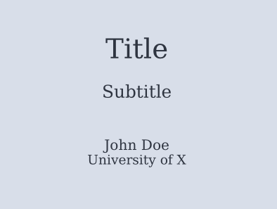

# groff-me-macros
## Differences from groff-me
### Bullet points
Bulleted lists can be made with a call to
```
.bu
```
this command takes two agruments
```
.bu [CONTENTS] [DEPTH]
```
for instance, the following groff input
```
.bu "One"
.bu "Two"
.bu "Two A" 1
.bu "Two A Alpha" 2
```
produces the following output

- One
- Two
  - Two A
    - Two A Alpha 
### Headings
A heading can be started with a call to
```
.uh
```
this command takes two arguments
```
.bu [CONTENTS] [DEPTH]
```
for instance, the following groff input
```
.uh "One"
.uh "Two"
.uh "Two A"
.uh "Two A Alpha"
```
produces the following output

# One
# Two
## Two A
### Two A Alpha

### Title Page
A title page can easily be created with two calls
```
.tt
.ta
```
both of these calls take two arguments
```
.tt "Title" "Subtitle"
.ta "Author" "Subtext"
```
The output will look like this



### Intext indents
The `.n` call can be used to make a tabbed indent at the start of the new line. This is useful for instance in writing dialogs.
```
John was astounded
.q "That is outrageous Mary!"
.n
.q "Not as outrageous as you may think"
.n
.q "Well I don't think we should go trough with it, think of the dangers!"
```
produces
```
John was astounded "That is outrageous Mary!"  
  "Not as outrageous as you may think"  
  "Well I don't think we should go trough with it, think of the dangers!"  
```
### References
By default, when using refer with groff, the bibliography section at the end of a paper is called "References", written out in bold text.
In the we macro set, the heading is set as a chapter name using the call
```
.+c "References"
```
meaning that it will conform to the heading structure you set for chapters.

Furthermore, the call
```
.rh
```
can change the default title
```
.rh "Notes and Bibliography"
```
Will replace the "References" heading with "Notes and Bibliography"

Lastly, the fontsize of the bibliography section has been increased to 12 to be consistent with the other `.+c` sections in your documents.

### Bold and Italics
The calls `.b .i .r .rb .bi` now all accept a third argument. This third argument will be prepended to the text in the previous font.

Example
```
.b "This in bold" ) (
```
produces  
(**This in bold**)

## Installation
Download both `we.tmac` and `refer-we.tmac` and install them to a groff accessible macro path such as `/usr/share/groff/current/tmac`.
The call groff with the `-mwe` option.

## Credit
Credit goes to to the University of California at Berkeley, Eric P. Allman and James Clark for making the original groff-me macros.
